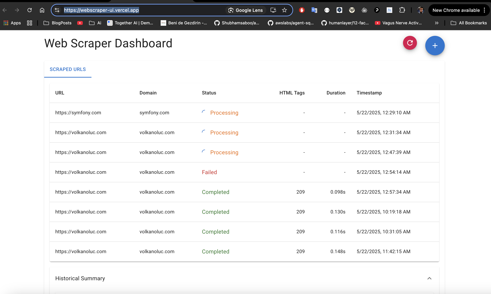

# Web Scraper Dashboard

A simple, elegant, and responsive Web Scraper Dashboard UI built with React and Material UI.



## Live Demo

Frontend: [https://webscraper-ui.vercel.app](https://webscraper-ui.vercel.app)  
Backend API: [https://weathered-glitter-9529.fly.dev](https://weathered-glitter-9529.fly.dev)

## Features

- **Main Table View**: Display a data table showing all previously crawled domains with details like domain name, URL, request duration, timestamp, HTML tag count, and status.
- **Add URL Functionality**: A prominent Add button to enter a new URL for crawling.
- **Status Updates**: Auto-refreshing table to monitor the status of each crawl operation.
- **Historical Summary**: View total HTML tag counts per domain in a collapsible panel.
- **Responsive Design**: Built with Material UI for a clean, modern, and responsive interface.

## Setup Instructions

### Prerequisites

- Node.js (>= 14.x)
- npm or yarn

### Environment Variables

Create a `.env` file in the root directory with the following content:

```
# For local development
REACT_APP_BACKEND_URL=http://localhost:5000

# For production
REACT_APP_BACKEND_URL=https://weathered-glitter-9529.fly.dev
```

### Installation

```bash
# Install dependencies
npm install --legacy-peer-deps

# Start the development server and the mock API server together
npm run dev

# OR start each server separately:
# Start only the React frontend
npm start

# Start only the mock API server
npm run mock-api
```

The frontend application will be available at [http://localhost:3000](http://localhost:3000).
The mock API server will be available at [http://localhost:5000](http://localhost:5000).

## API Endpoints

The application uses the following API endpoints (replace {domain} with either http://localhost:5000 for local development or https://weathered-glitter-9529.fly.dev for production)

